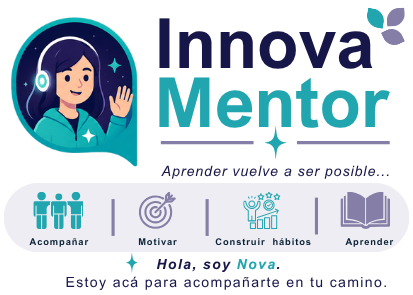

# 📚 Innova Mentor

<p align="center">
  
</p>

<h3 align="center">
Aprender vuelve a ser posible.
</h3>

<p align="center">

Aplicación Web Progresiva (PWA) desarrollada en <strong>React</strong> como parte del programa <strong>Innova Lab</strong>.

<strong>Innova Mentor</strong> acompaña a personas adultas que desean recuperar el hábito del estudio mediante un mentor virtual llamado <strong>Nova</strong>, pequeños desafíos diarios y contenido personalizado que fomente la constancia y el aprendizaje continuo.

</p>

---

# 🎯 Objetivo del proyecto

Desarrollar una plataforma educativa enfocada en el acompañamiento del aprendizaje adulto, ofreciendo una experiencia simple, motivadora y accesible desde cualquier dispositivo.

El propósito principal no es únicamente enseñar contenidos, sino ayudar al usuario a recuperar el hábito de estudiar.

---

# 💡 Nuestra propuesta

Innova Mentor propone una experiencia basada en tres pilares fundamentales:

* 🌱 Acompañar
* 🎯 Motivar
* 📈 Construir hábitos

A través del mentor virtual **Nova**, el usuario recibirá orientación, desafíos diarios y seguimiento de su progreso para fortalecer su compromiso con el aprendizaje.

---

# 🚀 Funcionalidades previstas para el MVP

* Registro e inicio de sesión.
* Selección de intereses.
* Mentor virtual (Nova).
* Feed de contenido educativo.
* Desafíos diarios.
* Seguimiento del progreso.
* Sistema de logros y rachas.
* Integración con Firebase.
* Conversaciones asistidas por Inteligencia Artificial (fase posterior).

---

# 🛠️ Tecnologías

## Frontend

* React
* Vite
* Progressive Web App (PWA)
* React Router (próximamente)
* Zustand (próximamente)

## Backend

* Node.js
* Express

## Base de datos

* Firebase
* Firestore

## APIs

* YouTube Data API
* OpenAI API (fase futura)

## Herramientas

* Git
* GitHub
* Vercel
* Figma
* Postman

---

# 📂 Arquitectura del proyecto

El proyecto sigue una arquitectura modular para facilitar el trabajo colaborativo y la escalabilidad.

```text
src/

├── api/
├── assets/
├── components/
├── config/
├── constants/
├── contexts/
├── hooks/
├── mocks/
├── pages/
├── routes/
├── services/
├── store/
├── styles/
├── types/
└── utils/
```

---

---

# 📚 Documentación

Toda la documentación técnica y funcional del proyecto se encuentra organizada en la carpeta **/docs**.

## 📂 Documentación técnica

- 📄 01 - Visión del proyecto
- 🎨 02 - Identidad visual
- 🏗️ 03 - Arquitectura
- 📝 04 - Historial de versiones
- 📋 05 - Backlog
- ⚙️ 06 - Decisiones técnicas
- 📖 07 - Diario de desarrollo

## 👤 Guía de usuario

- 🚀 Primeros pasos
- 🤖 Instalación en Android
- 🍎 Instalación en iPhone
- 💻 Instalación en Windows

> **Nota:** estos documentos se actualizarán durante todo el desarrollo del proyecto conforme se implementen nuevas funcionalidades y se tomen decisiones técnicas.

---

# ▶️ Instalación

Clonar el repositorio

```bash
git clone URL_DEL_REPOSITORIO
```

Ingresar al proyecto

```bash
cd innova-mentor
```

Instalar dependencias

```bash
npm install
```

Ejecutar en desarrollo

```bash
npm run dev
```

Generar versión de producción

```bash
npm run build
```

---

# 👥 Equipo de desarrollo

Proyecto desarrollado por el **Equipo 12** del programa **Innova Lab**.

Áreas involucradas:

* Frontend
* Backend
* UX/UI
* QA
* Data Analytics

---

# 🗺️ Estado del proyecto

Actualmente el proyecto se encuentra en fase de desarrollo del MVP.

Las decisiones de arquitectura documentadas en este repositorio constituyen una propuesta técnica inicial y podrán evolucionar conforme avancen las reuniones del equipo y las necesidades del proyecto.

---

# 📄 Licencia

Proyecto desarrollado con fines académicos dentro del programa **Innova Lab**.
